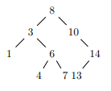

# Arbre Binaire de Recherche en Haskell

## Utilisation

- ghci
- :load TestBST
- TestAll (pour faire tout les test sur les fonctions)

## Information BST (binary search tree)

Un BST est definie comme suit :
data BST a = Empty | Node a (BST a) (BST a) deriving (Show, Eq)

example :: BST a
example = Node 8 (Node 3 (Node 1 Empty Empty) (Node 6 (Node 4 Empty Empty) (Node 7 Empty Empty) ) ) (Node 10 Empty (Node 14 (Node 13 Empty Empty) Empty ))

Représente l'arbre suivant:

## Fonction disponible

- Verifie si l'élément en paramètre est dans le BST ->> belongs :: (Eq a,Ord a) => a -> BST a -> Bool

- Renvoie une liste ordonnée des éléments du BST ->> toList :: BST a -> [a]

- Inserer un élément ->> insert :: (Eq a,Ord a) => a -> BST a -> BST a

- Vérifie si le BST est valide ->> valid :: (Bounded a, Eq a, Ord a) => BST a -> Bool

- Renvoie la plus petite valeur du BST ->> min :: BST a -> a

- Supprime la racine du BST ->> deleteRoot :: (Eq a,Ord a) => BST a -> BST a

- Utilise min et deleteRoot pour supprimer n'importe quel élément du BST ->> delete :: (Eq a,Ord a) => a -> BST a -> BST a
